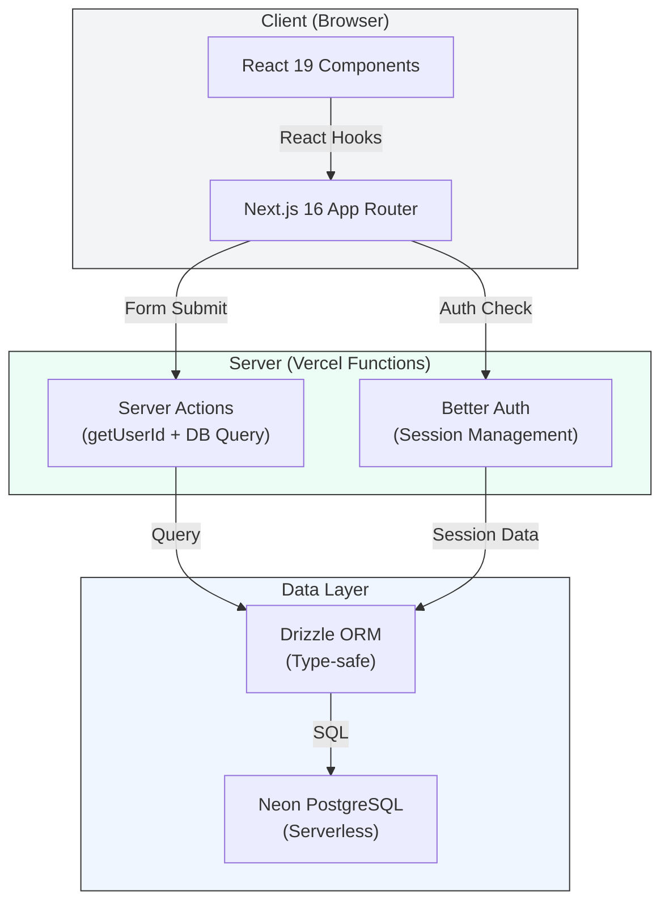

# FinTrack

**Expense tracking, budget management, and financial insights for the modern web**

[](https://github.com/yourusername/fintrack)
[](./LICENSE)
[](https://nextjs.org/)
[](https://orm.drizzle.team/)
[](https://neon.tech/)

## Why FinTrack?

Personal finance shouldn't be complicated. FinTrack brings clarity to your spending—track every transaction, set smart budgets, and understand your money with rule-based insights. Built for simplicity but designed to scale with you.

## Screenshots

> **Dashboard** — Real-time overview with balance, insights, and recent transactions
> 
> *(Add screenshot here)*

> **Expenses** — Detailed transaction list with filters and quick-add interface
> 
> *(Add screenshot here)*

> **Budgets** — Smart budget management with progress tracking and status indicators
> 
> *(Add screenshot here)*

> **Reports** — Visual analytics with spending trends, category breakdown, and income vs expenses
> 
> *(Add screenshot here)*

## Architecture



**Key flows:**
- All data operations are **server-side** (no direct DB access from browser)
- Every query scopes by `userId` — no Row Level Security needed
- Sessions stored in Postgres, validated on each request

## Tech Stack

| Layer | Technology | Purpose |
|-------|-----------|---------|
| **Frontend** | Next.js 16, React 19 | App routing & UI |
| **Styling** | Tailwind CSS v4, Lucide icons | Design system |
| **Charts** | Recharts | Data visualization |
| **Backend** | Next.js Server Actions | Business logic |
| **Auth** | Better Auth | Email/password sessions |
| **Database** | Neon PostgreSQL | Data persistence |
| **ORM** | Drizzle ORM | Type-safe queries |
| **Testing** | Vitest, Playwright | Unit & E2E tests |
| **Deployment** | Vercel | CI/CD & hosting |

## Setup & Local Development

### Prerequisites

- **Node.js** 18+ (verify with `node --version`)
- **pnpm** 8+ (`npm install -g pnpm`)
- **PostgreSQL** 14+ (or Neon account)

### Installation

```bash
# 1. Clone repository
git clone <your-repo-url>
cd fintrack

# 2. Install dependencies
pnpm install

# 3. Create .env.local
cp .env.example .env.local

# 4. Edit .env.local with:
#    DATABASE_URL=postgresql://...
#    BETTER_AUTH_SECRET=$(openssl rand -base64 32)
```

### Running Locally

```bash
# Start dev server (http://localhost:3000)
pnpm dev

# In another terminal, monitor changes
pnpm test:watch
```

First time? Create an account, complete onboarding, then add your first expense.

## Running Tests

### Unit Tests (Vitest)

```bash
pnpm test               # Run all tests once
pnpm test:watch        # Watch mode
pnpm test:coverage     # Coverage report (HTML in ./coverage)
```

**Coverage:**
- ✅ Insights engine: 14 tests (spending trends, budget recommendations, anomaly detection)
- ✅ Budget calculations: 12 tests (spent aggregations, status logic, edge cases)

### E2E Tests (Playwright)

```bash
pnpm test:e2e          # Run full user flow in browser
pnpm test:e2e:debug    # Interactive debugger
```

**Coverage:**
- ✅ Sign up → add expense → logout
- ✅ Unauthenticated access protection
- ✅ Login error handling

### Code Quality

```bash
pnpm lint               # ESLint + TypeScript
pnpm type-check        # Full TypeScript check (strict mode)
pnpm build             # Production build (0 errors, 20 ESLint warnings in client components)
```

## Deployment

### 1. Pre-deployment Checklist

```bash
pnpm build              # ✓ Must pass
pnpm type-check        # ✓ Must pass
pnpm lint               # ⚠ 20 warnings OK (mostly `any` types in interactive components)
```

### 2. Deploy to Vercel

```bash
# Option A: Push to GitHub (auto-deploys)
git push origin main

# Option B: Vercel CLI
vercel --prod
```

### 3. Environment Variables

Set these in **Vercel Project Settings → Environment Variables**:

```
DATABASE_URL=<auto-set by Neon integration>
BETTER_AUTH_SECRET=<run: openssl rand -base64 32>
```

### 4. Database Setup

- Connect Neon integration in Vercel
- Schema auto-creates on first production request
- No migrations required

## Project Structure

```
fintrack/
├── app/
│   ├── (app)/                    # Protected app routes
│   │   ├── dashboard/page.tsx    # Overview + insights + recent transactions
│   │   ├── expenses/page.tsx     # Expense CRUD
│   │   ├── budgets/page.tsx      # Budget management
│   │   ├── reports/page.tsx      # Charts + analytics
│   │   ├── settings/page.tsx     # User profile + data export/delete
│   │   └── layout.tsx            # Sidebar navigation
│   ├── api/auth/[...all]/route.ts # Better Auth handler
│   ├── login/signup/page.tsx     # Public auth pages
│   ├── onboarding/page.tsx       # Post-signup flow
│   ├── actions/                  # Server actions (all user-scoped)
│   │   ├── expenses.ts           # getExpenses, addExpense, etc.
│   │   ├── budgets.ts            # getBudgets, addBudget, etc.
│   │   ├── income.ts             # Income CRUD
│   │   ├── insights.ts           # Rule-based insights (0 API calls)
│   │   ├── reports.ts            # Chart data aggregations
│   │   └── settings.ts           # Profile, export, delete
│   ├── page.tsx                  # Landing page
│   └── layout.tsx                # Root layout
├── lib/
│   ├── auth.ts                   # Better Auth server config
│   ├── auth-client.ts            # Better Auth client
│   ├── db/
│   │   ├── index.ts              # Drizzle + pg Pool
│   │   └── schema.ts             # All tables (7 tables, 4 indexes)
│   └── categories.ts             # Expense category constants
├── components/
│   └── auth-form.tsx             # Shared sign-in/up form
├── __tests__/                    # Unit tests (26 tests)
├── e2e/                          # E2E tests (Playwright)
├── docs/adr/                     # Architecture decisions
├── .github/workflows/ci.yml      # GitHub Actions CI/CD
├── eslint.config.mjs             # ESLint v10 config
├── vitest.config.ts              # Vitest config
├── playwright.config.ts          # Playwright config
└── TESTING.md                    # Detailed testing guide
```

## Key Architectural Decisions

See `docs/adr/` for detailed rationales:

1. **Better Auth over NextAuth** — Simpler session management, explicit database control
2. **Rule-based insights (not LLM)** — Zero API costs, instant results, deterministic
3. **Neon serverless Postgres** — Auto-scaling, no DB ops overhead, pgBouncer built-in

## Security & Privacy

- **No API keys required** for core features (insights, budgets, reports)
- **Session-based auth** — Sessions stored in database, validated server-side
- **User-scoped queries** — Every DB query filters by `userId` (enforced in server actions)
- **No third-party integrations** — All data stays in your Neon database
- **Data export & deletion** — Full control in Settings page

## What's Next?

### Planned Features (Prompt C)

- 🏦 **Plaid integration** — Automatic transaction imports from 13,000+ institutions
- 🤖 **Real AI insights** — LLM-based spending analysis (Claude/OpenAI)
- 📱 **Mobile app** — React Native version
- 👥 **Collaborative budgets** — Family/team shared expenses
- 📊 **Advanced reports** — Tax summaries, recurring expense tracking

## Contributing

See [CONTRIBUTING.md](./CONTRIBUTING.md) — all contributions welcome.

## License

MIT — see [LICENSE](./LICENSE)

## Questions?

- 📖 Testing guide: [TESTING.md](./TESTING.md)
- 🏗️ Architecture: [docs/adr/](./docs/adr/)
- 🤝 Contributing: [CONTRIBUTING.md](./CONTRIBUTING.md)
- 📝 Deployment: [DEPLOYMENT.md](./DEPLOYMENT.md) (if needed)
